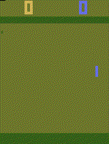

# Reinforcement Learning - AML

## Requirements
Please be sure to run the files with Python 3.8 - 3.9  
The installation of the needed libraries is specified in each .ipybn file.
Please run the notebooks on your own CPU (it might cause trouble when running in the server's GPUs)

## Deadline and Report
Please create a PDF document where you answer the questions found in the .ipybn files. (The questions are highlighted in bold).  

***IMPORTANT: Before uploading the modified .ipybn files be sure to clear all the outputs.***

The report (Lastname_RL.pdf) and the modified code must be submited before October 23th, 11:59pm.

## Part 1: Q-learning (2.5 points)

OpenAI created [Gym](https://gymnasium.farama.org/), an API standard for reinforcement learning with a diverse collection of reference environments. 
In this part of the homework, we will be using the [Cliff_Walking](https://www.gymlibrary.dev/environments/toy_text/cliff_walking/) environment, which is part of the Atari environments. In order to visualize the environment, running the code on your local computer's CPU is required.

## Part 2: PPO (2.5 points)

Now you will use the same [Gym] API to implement the PPO algorithm in another environment from Gym: the classic game of Pong. This notebook is inside the ppo pong folder. Please make sure you have the parallelEnv.py file in the same folder as the notebook Pong PPO.ipynb when running it.

## References 

Greg Brockman and Vicki Cheung and Ludwig Pettersson and Jonas Schneider and John Schulman and Jie Tang and Wojciech Zaremba. OpenAI Gym, 2016. https://github.com/openai/gym

The first part of this homework was based on https://huggingface.co/learn/deep-rl-course/unit2/hands-on

The second part of this homework was based on https://github.com/bmaxdk/OpenAI-Gym-PongDeterministic-v4-PPO

